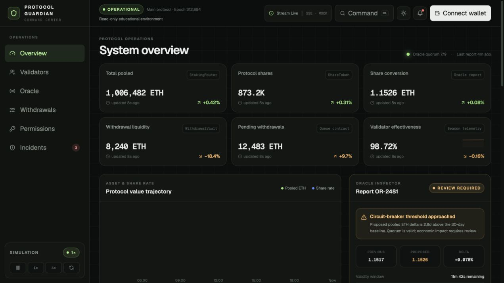
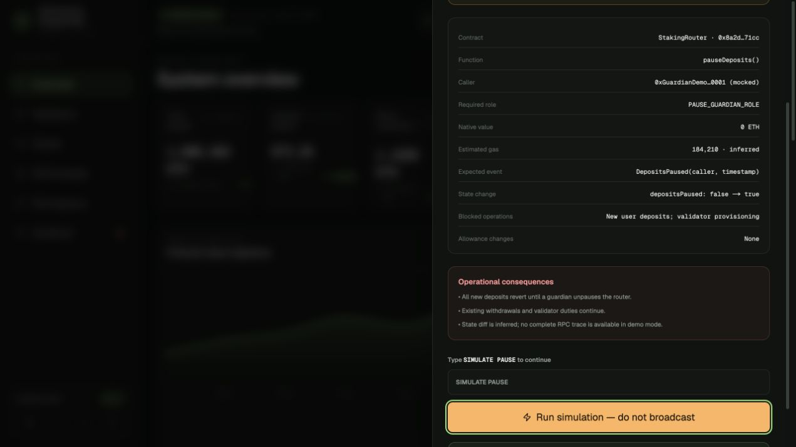

# Protocol Guardian Command Center

[](https://github.com/lalitheswaran11-stack/protocol-guardian-command-center/actions/workflows/ci.yml)

[Open the live demo](https://protocol-guardian-command-center.lalitheshnarayanan.chatgpt.site)

Protocol Guardian Command Center is a read-only DeFi operations dashboard for investigating validator health, oracle anomalies, withdrawal pressure, permissions, and incidents.

All displayed protocol data is simulated. The emergency-action workflow previews a pause operation but never constructs, signs, or broadcasts a transaction.

For a quick walkthrough, filter the validator table, open the live event stream, then use **SIMULATE PAUSE** to review the permission, calldata intent, and operational consequences before typed confirmation.

## Features

- Protocol health metrics and trend charts
- Searchable 5,000-validator data set with operational filters and CSV export
- Sequenced server-sent events with duplicate and ordering guards
- Oracle-report review and withdrawal stress controls
- Permission relationships and incident timeline
- Typed-confirmation emergency simulation
- URL-persisted filters, responsive layout, and light/dark themes
- Unit, browser, and CI checks

## Run locally

Requires Node.js 20.9 or newer.

```bash
npm ci
npm run check
npm run dev
```

Open [http://localhost:3000](http://localhost:3000). No wallet or secret is required.

Browser tests require Playwright's Chromium binary:

```bash
npx playwright install chromium
npm run test:e2e
```

## Data labels

- **Mock:** protocol metrics, validators, oracle reports, incidents, and events
- **Inferred:** gas, state changes, and consequences shown in the pause preview
- **Read-only:** wagmi and viem providers are configured without wallet connectors or write transports

## Repository map

```text
src/components/   dashboard sections and interaction components
src/lib/          fixture generation, filtering, event handling, and local workflow state
src/app/api/      simulated server-sent event route
e2e/              Playwright workflows
docs/             architecture, security, testing, and limitations
```

See [architecture](docs/ARCHITECTURE.md), [security](docs/SECURITY.md), [testing](docs/TESTING.md), and [known limitations](docs/KNOWN_LIMITATIONS.md).

## Screenshots




