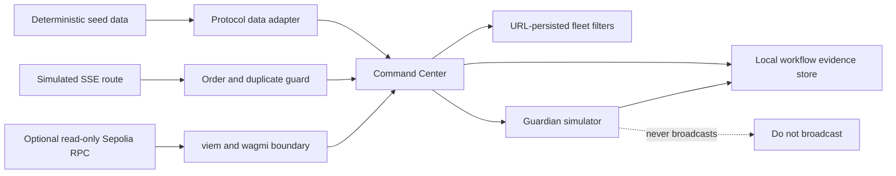

# Architecture

The dashboard uses Next.js App Router. React owns temporary view state, URL parameters store shareable validator filters, and Zustand persists the incident timeline. TanStack Query and wagmi isolate the places where remote or chain data could be added later.

## Data lifecycle

1. Deterministic generators create reproducible protocol and validator records.
2. The SSE route emits sequenced events. The client rejects duplicate IDs and sorts out-of-order events.
3. Staleness and connection status are visible in the global header.
4. Simulation inputs produce local projections. The app records completed simulations in the device-local incident timeline.
5. Blockchain replacement points are isolated behind the wagmi/viem provider and the protocol data module.

## Scaling

The demo generates 5,000 rows once, filters them with memoization, and paginates to eight visible rows. A larger data set should move indexing server-side and use windowed rendering.
